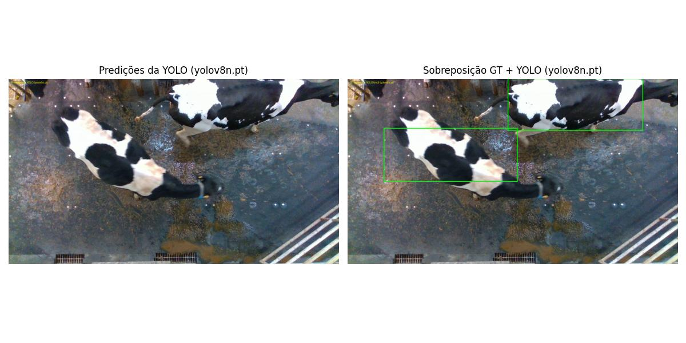
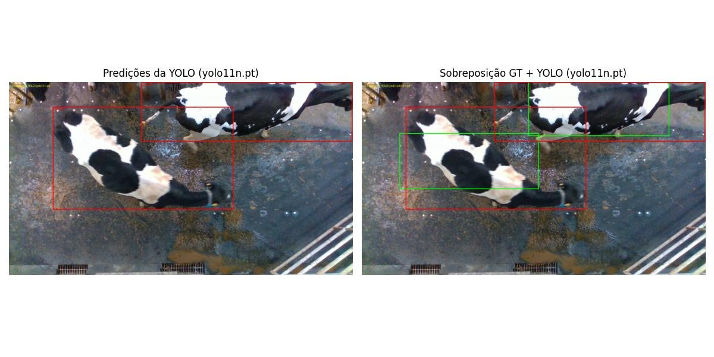
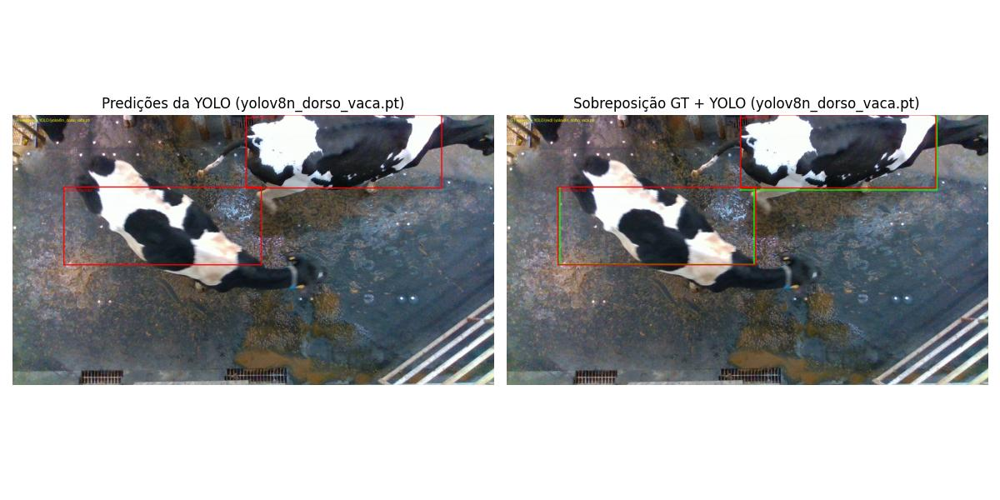

# Projeto: Detecção de Vacas com YOLO

Este projeto treina e avalia um modelo YOLO para detectar vacas (cattle torso) usando o dataset **cows2021-DatasetNinja**.
Ele inclui scripts para **treinamento** e **predição** com visualização e métricas.O objetivo é aplicar uma predição na imagem `00061.jpg`com alguns modelos yolo e o modelo treinado especificamente no dataset abaixo.


## Estrutura do dataset (necessário antes de rodar)

O Ultralytics espera `images/` e `labels/`. Como o dataset original usa `img/`, renomeie **uma vez** em cada split:

Baixe o dataset aqui:
```text
https://datasetninja.com/cows2021
```

```powershell
Rename-Item cows2021-DatasetNinja\detection_and_localisation-train\img images
Rename-Item cows2021-DatasetNinja\detection_and_localisation-val\img images
Rename-Item cows2021-DatasetNinja\detection_and_localisation-test\img images
```

As anotações originais continuam em `ann/`. O script `treinar.py` gera as labels YOLO em `labels/` e tambem guarda uma cópia em `ann_yolo/`.

## Ambiente virtual (.venv)

Crie e ative o ambiente:

```powershell
python -m venv .venv
.\.venv\Scripts\activate
```

Instale as dependências:

```powershell
pip install ultralytics numpy pillow matplotlib
```

> Observação: o `ultralytics` instala o `torch`. Se houver problema, instale o PyTorch manualmente conforme a sua GPU.

## GPU (CUDA) vs CPU

Em algumas máquinas o PyTorch pode instalar **somente CPU**. Nesse caso o treino **nao usa a GPU NVIDIA**.
Se o teste abaixo retornar `False no-cuda`, instale a versao CUDA do PyTorch:

```powershell
python -c "import torch; print(torch.cuda.is_available(), torch.cuda.get_device_name(0) if torch.cuda.is_available() else 'no-cuda')"
```

Exemplo (CUDA 12.1):

```powershell
pip uninstall torch torchvision torchaudio -y
pip install torch torchvision torchaudio --index-url https://download.pytorch.org/whl/cu121
```

Depois, rode novamente o teste. Se aparecer `True` e o nome da sua GPU, o treino vai usar CUDA.

### GPUs muito novas (ex.: RTX 5070 / sm_120)

Se você ver um aviso dizendo que a GPU **não e compatível com o build atual** (ex.: RTX 5070 com `sm_120`) ou erro `cudaErrorNotSupported`,
isso significa que o PyTorch instalado não suporta a versão do driver ou a arquitetura.

Solução: instalar um build Nightly compatível (tente `cu128` ou `cu126` se o driver não suportar `cu130`):

```powershell
pip uninstall torch torchvision torchaudio -y
# Tente cu128 (recomendado para drivers recentes da série 50)
pip install --pre torch torchvision torchaudio --index-url https://download.pytorch.org/whl/nightly/cu128
```

## Treinamento

Treina a partir de um modelo base (ex.: `yolov8n.pt` - configurável no  `treinar.py`) e gera um modelo customizado:

```powershell
python .\treinar.py
```

Saída esperada: `yolov8n_dorso_vaca.pt` (configurável no `treinar.py`).

**Importante:** o `00061.jpg` e o `00061.jpg.json` são **excluídos explicitamente** do treino para evitar data leakage. O nome do arquivo é configurável no `treinar.py`.

## Predição / Avaliação

Para rodar a predicao e visualizar os boxes:

```powershell
python .\predicao_vacas.py
```

No arquivo `predicao_vacas.py`, ajuste:

```python
MODEL_PATH = Path("yolov8n_dorso_vaca.pt")
CLASSE_ALVO = "cow"   **IMPORTANTE:Use "cow" para modelos base; "cattle_torso" para o modelo treinado**.
```

Se quiser comparar com o modelo base, troque para `yolov8n.pt`, `yolo11n.pt`, por exemplo.

## Exemplos de execucao (predicao_vacas.py)

Execute:

```powershell
python .\predicao_vacas.py
```

Exemplos de resultado (imagens salvas):

Resultado com yolov8n


Resultado com yolo11n


Resultado com yolov8n_dorso_vaca

## Resultados obtidos com cada modelo no dataset para a vaca 00061:

### Modelo usado: yolov8n.pt
Classe alvo: cow
Caixas GT: 2
Caixas preditas (classe alvo): 0
Correspondências (ordenadas por confiança):
AP@0.5: 0.0000
mAP@0.5 (imagem/classe única): 0.0000
Nenhuma predição da classe 'cow' foi encontrada.
Outras classes detectadas (top 10 por confiança):
  1. bear conf=0.376 box=[155.2734375, 87.34548950195312, 820.652099609375, 476.3465270996094]

### Modelo usado: yolo11n.pt
Classe alvo: cow
Caixas GT: 2
Caixas preditas (classe alvo): 2
Correspondências (ordenadas por confiança):
  1. conf=0.461 iou=0.597 tp=True box=[492.350341796875, 2.613983154296875, 1278.418212890625, 223.65582275390625]
  2. conf=0.392 iou=0.394 tp=False box=[163.54876708984375, 94.47372436523438, 835.0955810546875, 476.0425720214844]
AP@0.5: 0.5000
mAP@0.5 (imagem/classe única): 0.5000

### Modelo usado: yolov8n_dorso_vaca.pt
Classe alvo: cattle_torso
Caixas GT: 2
Caixas preditas (classe alvo): 2
Correspondências (ordenadas por confiança):
  1. conf=0.820 iou=0.971 tp=True box=[135.740478515625, 192.98541259765625, 662.502685546875, 401.6798095703125]
  2. conf=0.342 iou=0.971 tp=True box=[620.268798828125, 0.0, 1141.380615234375, 197.21102905273438]
AP@0.5: 1.0000
mAP@0.5 (imagem/classe única): 1.0000


